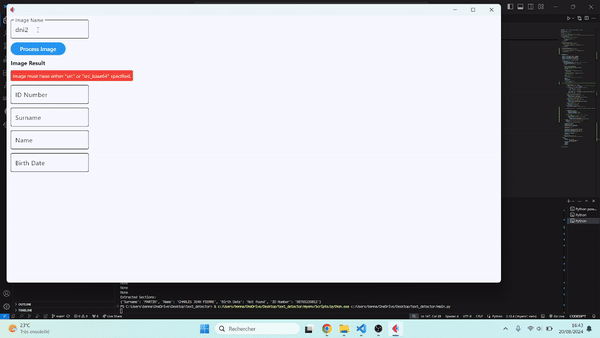

# ID Document Information Recognizer

## Overview

The ID Document Information Recognizer is a Python-based application designed to extract and display information from images of French ID cards (Carte Nationale d'Identité). This initial version of the project processes a photo of an ID card to retrieve key details such as the surname, name, birth date, and ID number.

## Features

- **Image Processing**: Load an image of a French ID card and extract text from it.
- **Text Extraction**: Identify and extract specific fields from the text, including surname, name, birth date, and ID number.
- **User Interface**: A simple interface to input the image file name and display the extracted information.

## How It Works

1. **Image Input**: Provide the file name of the ID card image.
2. **Processing**: The application uses Optical Character Recognition (OCR) to read the text from the image.
3. **Extraction**: Extract relevant fields from the recognized text, including:
   - Surname
   - Name
   - Birth Date
   - ID Number
4. **Display**: Show the extracted information in the user interface and save the results in a text file.


## Example

Here’s a brief demonstration of how the application works:



## Installation

1. **Clone the Repository**:
   ```sh
   git clone https://github.com/AmineBennani7/id-recognizer.git

2. **Install Dependencies**:
   ```sh
   pip install -r requirements.txt

3. **Run the app**:
   ```sh
   python main.py

   
   


